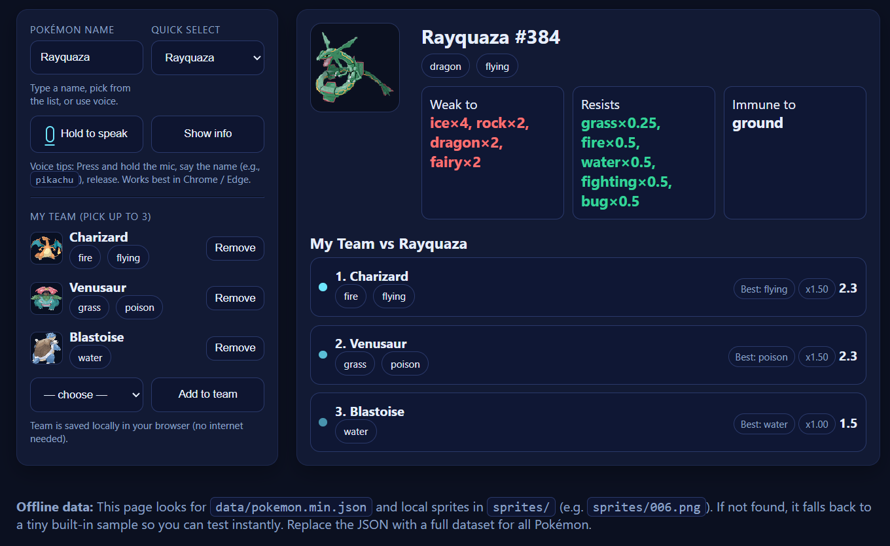
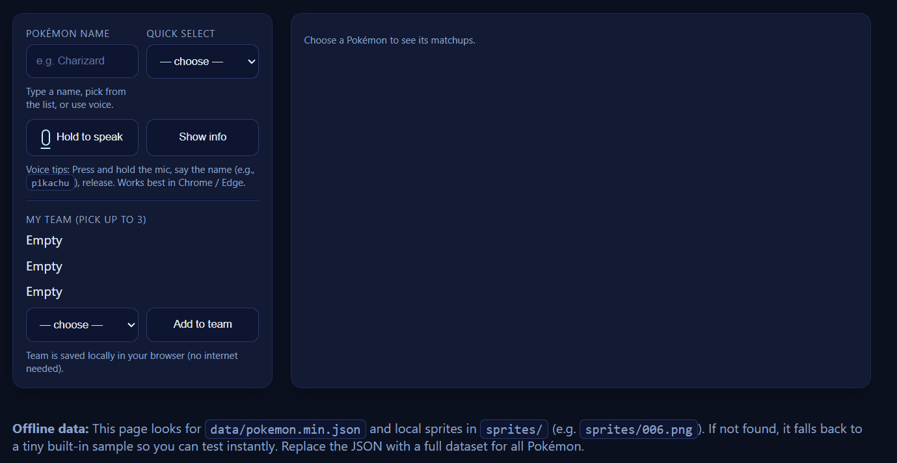

# 🎙️ Voice Pokédex — Offline Team Assistant  

An **offline Pokédex web app** that listens to your voice, shows **type weaknesses/resistances**, and ranks your chosen team of Pokémon against opponents.  
Built with **HTML/CSS/JS**, powered by **local JSON + sprites**, and completely offline once set up.

---

## ✨ Features
- 🎤 **Voice recognition** (Web Speech API) — say a Pokémon’s name to instantly fetch its info.  
- ⌨️ **Fallback search** — type or pick from a dropdown.  
- 🧩 **Type matchups** — see weaknesses, resistances, and immunities using a Gen-9 style type chart.  
- 🖼 **Sprites included offline** — official artwork and in-game sprites packaged locally.  
- 👥 **Team builder** — choose up to 3 Pokémon; their matchups are ranked against the selected opponent.  
- 💻 **Completely offline** — no API calls, works without internet once installed.  

---

## 🖼️ Screenshots


---

## 🚀 Running the App

This is a **static site** (HTML, CSS, JS, JSON). To run it locally:

```bash
cd po-go-battle-assistant
python -m http.server 8000
```
## 🖥️ Download
Grab the latest [release](https://github.com/roryMansell/po-go-battle-assistant/releases).

1. Download `VoicePokedex-win64.zip`
2. Extract it somewhere
3. Double-click `Voice Pokedex.exe`